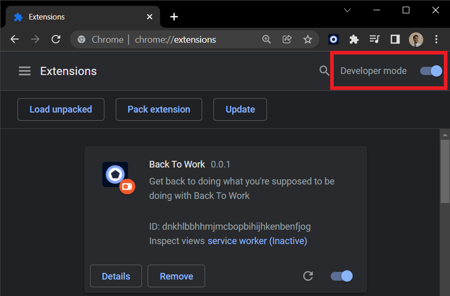
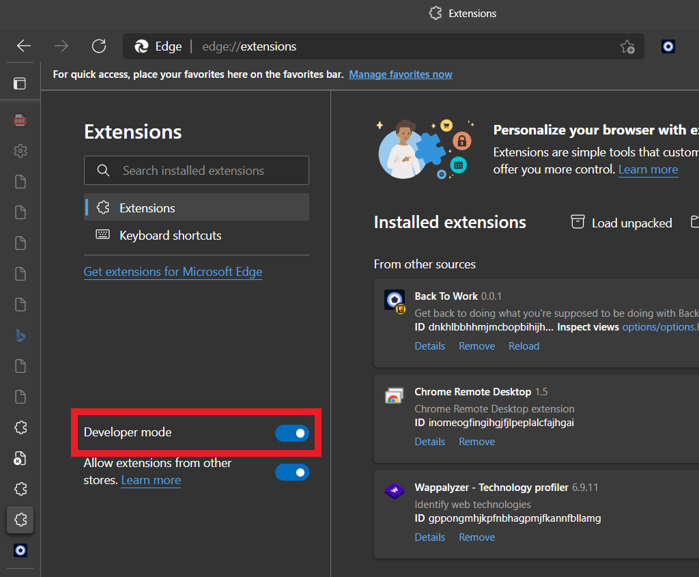
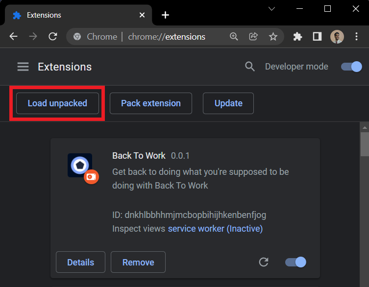
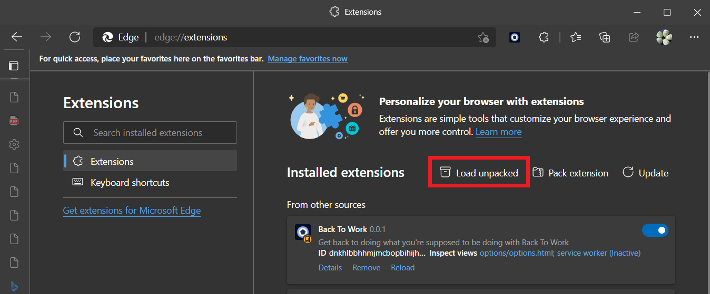

 

    

<h1 align="center">Back to Work</h2>
 

    A simple browser extension, intended to get you <strong><i>Back To Work</i></strong> when you start slacking off to one of those really addictive sites.

 

<h2>How to install?</h2>

<ol>
    <li>
        Clone the repository or download the latest release archive from <a href="https://github.com/dheerajdlalwani/back-to-work/releases/latest" target="_blank" rel="noopener">here</a>.
    </li>
    <li>
        If you are on Google Chrome Browser, open new tab & type: <i>chrome://extensions</i> or if you are on Microsoft Edge Browser, type: <i>edge://extensions</i>.
    </li>
    <li>
        Look for the <strong>Developer mode</strong> toggle & turn it on if it's not already.
    </li>
    <li>
        Here's where to find it in -
        <ul>
            <li>Chrome</li>
            
            <li>Edge</li>
            
        </ul>
    </li>
    <li>
        Next, click on <strong>Load unpacked</strong>.
    </li>
    <li>
        Here's where to find it in -
        <ul>
            <li>Chrome</li>
            
            <li>Edge</li>
            
        </ul>
    </li>
    <li>
        Then navigate to the extracted folder if you downloaded it from the <em>Releases</em> page or to the <strong>src</strong> folder if you have cloned the source code.
    </li>
    <li>
        There you go! Your extension is installed.
    </li>
</ol>

 

<h2>What does it really do?</h2>

    Well thats easy to understand. There are 2 modes.
    <ol>
        <li>Work</li>
        <li>Chill</li>
    </ol>
    When you switch to work mode, it asks you to list all the websites that you are addicted to.For example: YouTube, Instagram, Twitter... And it locks you out of those websites.

<h2>For how long? How do I unlock them? I need to have some fun at least...</h2>

    The extension asks you to choose one out of the two unlocking modes-

<h3>Time Based</h3>

    In time based locking mode. It will ask you for how long you wish to lock these websites and they will be forbidden. If you still try to visit these websites, you shall be redirected to a standard page, reminding you to get back to your tasks or redirect you to a website of your choice.

<h3>Password Based</h3>

    In password based unlocking, you shall be asked to type in an unlocking password which can be set by someone else and can be unlocked by them once you are done with your work.

<h3>Compatibility</h3>

    Currently, this extension works only on Chrome, Edge and hopefully other Chromium based browsers. But one of the long term goals for this project is to be cross browser compatible. If you wish to help me make them compatible across browsers, feel free to open a <a href="https://github.com/dheerajdlalwani/back-to-work/issues/new">new issue</a> or shoot me an email or direct message me at any of my socials 👇🏼
    <ul>
        <li><a href="mailto:lalwanidheeraj1234+BackToWork@gmail.com">lalwanidheeraj1234+BackToWork@gmail.com</a></li>
        <li><a href="https://twitter.com/DhiruCodes">Twitter - DhiruCodes</a></li>
        <li><a href="https://www.linkedin.com/in/lalwanidheeraj">LinkedIn - lalwanidheeraj</a></li>
    </ul>

<h3>Contributing</h3>

<ul>
    <li>The project is currently in the very initial stages of development. So I am currently not accepting any Pull Requests.</li>
    <li>However, contributions in the form of feature requests & bug reports are most welcome. 😊</li>
</ul>

<h3>Code of Conduct</h3>

Please be mindful of the [Code of Conduct](CODE_OF_CONDUCT.md) while contributing and interacting.
